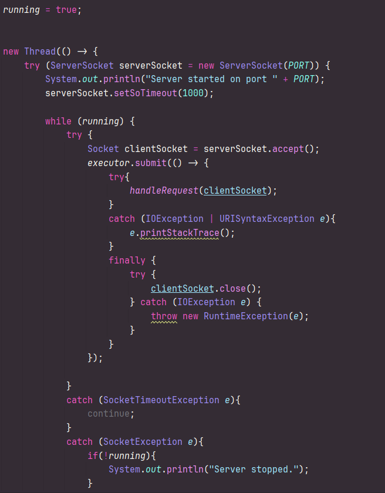
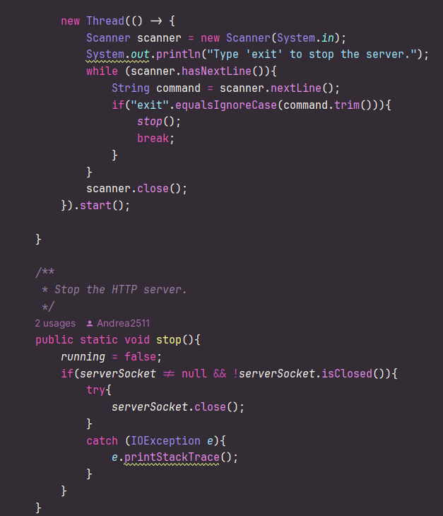
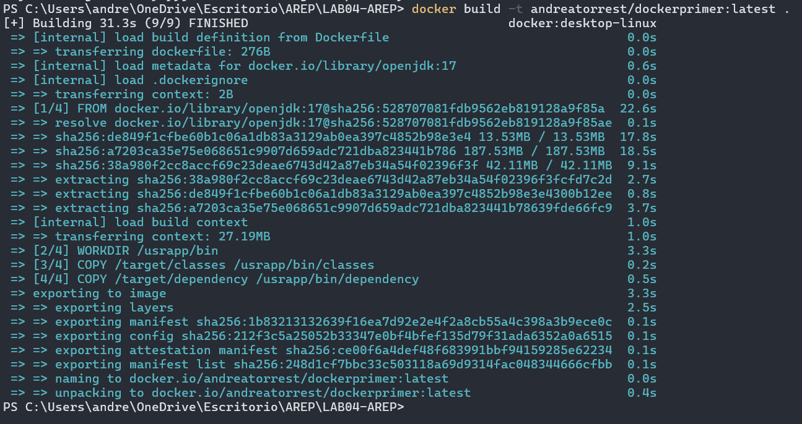
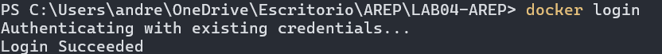
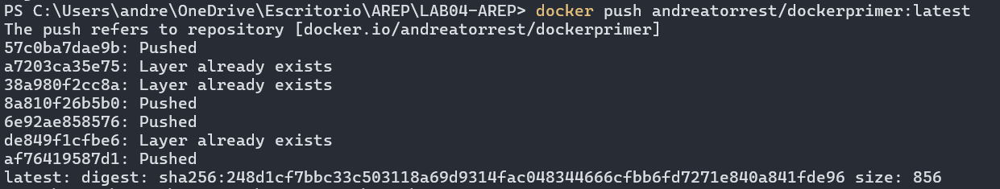

# AREP - Taller de Modularización con Docker y AWS

## Descripción del Proyecto

Este proyecto consiste en la creación de una aplicación web en Java sin utilizar frameworks como Spring, con la capacidad de responder solicitudes HTTP. La aplicación ha sido diseñada para ejecutarse de manera concurrente y puede apagarse de forma elegante. Posteriormente, se encapsula en un contenedor Docker y se despliega en AWS usando EC2.

Se implemtó un hilo que ejecuta el servidor



Asi mismo, se implmentó un hilo que para el servidor cuando se escribe "exit"



## Getting Started

Estas instrucciones te ayudarán a obtener una copia del proyecto en tu máquina local para desarrollo y pruebas.

### Prerequisitos

- Tener instalado Java 17 o superior.

- Tener instalado Maven para la gestión de dependencias.

- Tener instalado Docker en la máquina.

- Tener una cuenta en Docker Hub.

- Tener una cuenta en AWS con acceso a EC2.

## Instalación

1. Clonar el Repositorio

```bash
git clone https://github.com/Andrea2511/LAB04-AREP.git
cd arep-taller-docker
```

2. Compilar el Proyecto

```bash
mvn clean install
```

Esto generará los archivos .class en target/classes y las dependencias en target/dependency.

3. Ejecutar la Aplicación Localmente

```bash
java -cp "target/classes:target/dependency/*" co.eci.edu.arep.Main
```

El servidor se iniciará en el puerto 8080. Puedes probarlo accediendo a:

```bash
http://localhost:8080/app/hello?name=Juan
```

## Pruebas

Para correr las pruebas unitarias del sistema, usa:

```bash
mvn test
```

## Docker: Construcción y Ejecución

1. Construir la Imagen Docker

Ejecuta el siguiente comando para crear la imagen del contenedor:

```bash
docker build -t andreatorrest/dockerprimer .
```




3. Subir la Imagen a Docker Hub

```bash
docker login

docker push andreatorrest/dockerprimer:latest
```




## Despliegue en AWS

1. Configurar EC2

Iniciar una instancia en AWS con Amazon Linux 2.

Abrir el puerto 8080 en el grupo de seguridad.

Conectarse por SSH a la instancia.

2. Instalar Docker en AWS

```bash
sudo yum update -y
sudo yum install docker -y
sudo service docker start
sudo usermod -aG docker ec2-user
logout
```

Luego, vuelve a conectarte.

3. Descargar y Ejecutar el Contenedor en EC2

```bash
docker pull andreatorrest/dockerprimer:latest
docker run -d -p 8080:8080 andreatorrest/dockerprimer:latest
```

Accede desde el navegador usando la IP pública de la instancia:

http://<AWS_PUBLIC_IP>:8080/greeting?name=Juan

## Tecnologías Utilizadas

- Java 17 - Lenguaje de programación

- Maven - Gestión de dependencias

- Docker - Contenerización de la aplicación

- AWS EC2 - Despliegue en la nube

## Versionado

1.0

## Autores

Andrea Valentina Torres Tobar - Desarrollo Inicial

Escuela Colombiana de Ingeniería Julio Garavito - Curso de AREP
